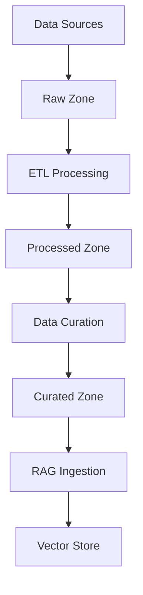

# Data Lake Setup and Configuration

*Understanding and configuring the 3-zone data lake architecture*

## Overview

Our data lake follows the industry-standard 3-zone architecture for organizing data from raw ingestion to production-ready formats. This guide explains how to set up, configure, and operate the data lake effectively.

## 🏗️ Data Lake Architecture

### Zone Structure

```
📦 Data Lake (MinIO S3-Compatible Storage)
├── 🗂️ raw-data/           # Landing zone for all incoming data
│   ├── articles/           # Raw articles and documents
│   ├── products/           # Product information
│   ├── databases/          # Database extracts
│   ├── apis/              # API responses
│   └── streaming/         # Real-time stream data
├── 🗂️ processed-data/     # Validated and cleaned data
│   ├── articles/          # Processed articles
│   ├── products/          # Standardized product data
│   └── quality-reports/   # Data quality metrics
├── 🗂️ curated-data/       # RAG-ready, high-quality data
│   ├── documents/         # Chunked and formatted documents
│   ├── embeddings/        # Pre-computed embeddings
│   └── metadata/          # Enhanced metadata
├── 🗂️ documents/          # Final document store
│   ├── ingested/          # Successfully processed documents
│   └── failed/            # Failed processing attempts
└── 🗂️ models/            # ML models and artifacts
    ├── embeddings/        # Embedding models
    ├── classifiers/       # Classification models
    └── versions/          # Model version history
```

### Data Flow



## 🚀 Setup Instructions

### 1. Initialize Data Lake Storage

```bash
# Start MinIO data lake
docker-compose -f docker-compose.datalake.yml up -d minio-datalake minio-init

# Verify buckets were created
docker exec -it $(docker ps -q -f name=minio-datalake) mc ls minio/
```

Expected output:
```
[2024-01-15 10:30:00 UTC]     0B raw-data/
[2024-01-15 10:30:00 UTC]     0B processed-data/
[2024-01-15 10:30:00 UTC]     0B curated-data/
[2024-01-15 10:30:00 UTC]     0B documents/
[2024-01-15 10:30:00 UTC]     0B models/
```

### 2. Configure Access Credentials

Create data lake configuration:

```bash
cat > configs/datalake-config.yaml << 'EOF'
datalake:
  endpoint: "http://localhost:9000"
  access_key: "admin"
  secret_key: "password123"
  secure: false
  region: "us-east-1"
  
buckets:
  raw: "raw-data"
  processed: "processed-data"
  curated: "curated-data"
  documents: "documents"
  models: "models"

zones:
  raw:
    retention_days: 90
    encryption: false
    versioning: true
  processed:
    retention_days: 180
    encryption: false
    versioning: true
  curated:
    retention_days: 365
    encryption: true
    versioning: true
    
quality_checks:
  enabled: true
  min_file_size: 100  # bytes
  max_file_size: 100000000  # 100MB
  allowed_formats: ["txt", "pdf", "docx", "json", "csv", "md"]
EOF
```

### 3. Set Up Data Connectors

Configure various data source connectors:

```python
# Example: Database connector configuration
DATABASE_CONFIG = {
    "source_name": "production_db",
    "type": "postgresql",
    "host": "prod-db.company.com",
    "port": 5432,
    "database": "app_data",
    "username": "${DB_USER}",
    "password": "${DB_PASSWORD}",
    "tables": [
        "customers",
        "orders", 
        "products",
        "reviews"
    ],
    "incremental": True,
    "batch_size": 10000
}

# Example: S3 connector configuration  
S3_CONFIG = {
    "source_name": "legacy_documents",
    "endpoint_url": "https://s3.amazonaws.com",
    "access_key": "${AWS_ACCESS_KEY}",
    "secret_key": "${AWS_SECRET_KEY}",
    "bucket": "company-documents",
    "prefix": "knowledge-base/",
    "region": "us-west-2"
}

# Example: API connector configuration
API_CONFIG = {
    "source_name": "content_api",
    "base_url": "https://api.contentprovider.com",
    "endpoints": ["articles", "blogs", "documentation"],
    "headers": {
        "Authorization": "Bearer ${API_TOKEN}",
        "Content-Type": "application/json"
    },
    "rate_limit": 100,  # requests per minute
    "pagination": True
}
```

## 📊 Data Management Operations

### Uploading Data to Raw Zone

#### Via Web Interface

1. Access MinIO console: http://localhost:9001
2. Login with `admin` / `password123`
3. Navigate to `raw-data` bucket
4. Create appropriate subdirectory
5. Upload files using drag-and-drop

#### Via Command Line

```bash
# Install MinIO client
wget https://dl.min.io/client/mc/release/linux-amd64/mc
chmod +x mc && sudo mv mc /usr/local/bin/

# Configure MinIO client
mc alias set datalake http://localhost:9000 admin password123

# Upload single file
mc cp document.pdf datalake/raw-data/documents/

# Upload directory
mc cp --recursive ./data-folder/ datalake/raw-data/batch-upload/

# Sync directory (only new/changed files)
mc mirror ./local-docs/ datalake/raw-data/documents/
```

#### Via Python API

```python
from src.prod_rag.data_lake.data_lake import get_data_lake_manager
import asyncio

async def upload_to_raw_zone():
    data_lake = get_data_lake_manager()
    
    # Upload text content
    with open('document.txt', 'r') as f:
        content = f.read()
    
    asset = await data_lake.store_data(
        data=content,
        zone='raw',
        key='documents/new-document.txt',
        metadata={
            'source': 'manual_upload',
            'author': 'John Doe',
            'department': 'Engineering'
        },
        tags=['documentation', 'manual'],
        source='manual_upload'
    )
    
    print(f"Uploaded: {asset.path}")

# Run upload
asyncio.run(upload_to_raw_zone())
```

### Data Quality Validation

#### Automated Quality Checks

The system automatically validates data in the raw zone:

```python
# Quality check configuration
QUALITY_RULES = {
    "file_size": {
        "min_bytes": 100,
        "max_bytes": 100_000_000  # 100MB
    },
    "content_checks": {
        "min_content_length": 50,
        "detect_encoding": True,
        "virus_scan": False  # Enable for production
    },
    "format_validation": {
        "allowed_extensions": [".txt", ".pdf", ".docx", ".md", ".json"],
        "mime_type_check": True
    },
    "metadata_requirements": {
        "required_fields": ["source", "upload_date"],
        "optional_fields": ["author", "department", "tags"]
    }
}
```

#### Manual Quality Assessment

```bash
# Check data quality metrics
curl http://localhost:8000/api/v1/data-lake/quality-report

# View quality issues
curl http://localhost:8000/api/v1/data-lake/quality-issues
```

### Data Lifecycle Management

#### Zone Promotion

Data flows through zones via ETL processes:

```python
# Example: Promote data from raw to processed
async def promote_to_processed():
    data_lake = get_data_lake_manager()
    
    # Define transformation function
    def clean_and_standardize(raw_data):
        # Remove special characters
        cleaned = re.sub(r'[^\w\s]', '', raw_data)
        # Standardize whitespace
        cleaned = ' '.join(cleaned.split())
        # Convert to lowercase
        cleaned = cleaned.lower()
        return cleaned
    
    # Promote with transformation
    processed_asset = await data_lake.promote_data(
        source_zone='raw',
        target_zone='processed', 
        key='documents/document.txt',
        transformation_func=clean_and_standardize
    )
    
    print(f"Promoted to: {processed_asset.path}")
```

#### Data Retention Policies

Configure automatic cleanup:

```yaml
# In configs/datalake-config.yaml
retention_policies:
  raw_zone:
    max_age_days: 90
    archive_before_delete: true
    archive_location: "s3://archive-bucket/raw/"
  
  processed_zone:
    max_age_days: 180
    compress_after_days: 30
    
  curated_zone:
    max_age_days: 365
    backup_enabled: true
    backup_frequency: "weekly"
```

## 🔄 ETL Pipeline Integration

### Airflow DAG Configuration

Configure the data ingestion DAG:

```python
# In Airflow Variables (Admin -> Variables)
{
  "data_sources_config": {
    "s3": {
      "source_name": "company_documents",
      "endpoint_url": "http://minio-datalake:9000",
      "access_key": "admin",
      "secret_key": "password123",
      "bucket": "raw-data",
      "prefix": "documents/"
    },
    "database": {
      "source_name": "customer_data",
      "type": "postgresql",
      "host": "postgres",
      "port": 5432,
      "database": "prod_rag",
      "username": "rag_user",
      "password": "rag_password",
      "tables": ["documents", "customer_feedback"]
    }
  },
  "processing_config": {
    "batch_size": 1000,
    "quality_threshold": 0.8,
    "enable_deduplication": true,
    "text_extraction": {
      "pdf_engine": "pypdf",
      "ocr_enabled": false,
      "language_detection": true
    }
  }
}
```

### Custom ETL Steps

Add custom processing steps:

```python
# Custom data processor
class CustomDocumentProcessor:
    def __init__(self, config):
        self.config = config
    
    def process_document(self, document_content, metadata):
        """Custom document processing logic."""
        # Extract key information
        extracted_data = self.extract_key_info(document_content)
        
        # Enrich metadata
        enhanced_metadata = self.enrich_metadata(metadata, extracted_data)
        
        # Apply business rules
        processed_content = self.apply_business_rules(document_content)
        
        return {
            'content': processed_content,
            'metadata': enhanced_metadata,
            'quality_score': self.calculate_quality_score(processed_content)
        }
    
    def extract_key_info(self, content):
        """Extract key information using NLP."""
        # Implement custom extraction logic
        pass
    
    def enrich_metadata(self, metadata, extracted_data):
        """Enhance metadata with extracted information."""
        enhanced = metadata.copy()
        enhanced.update({
            'extracted_entities': extracted_data.get('entities', []),
            'topics': extracted_data.get('topics', []),
            'language': extracted_data.get('language', 'en'),
            'readability_score': extracted_data.get('readability', 0)
        })
        return enhanced
```

## 📈 Monitoring and Observability

### Data Lake Metrics

Monitor data lake health:

```python
# Get comprehensive data lake statistics
async def get_datalake_stats():
    data_lake = get_data_lake_manager()
    stats = await data_lake.get_zone_statistics()
    
    print("Data Lake Statistics:")
    for zone, zone_stats in stats.items():
        print(f"\n{zone.upper()} Zone:")
        print(f"  Total Assets: {zone_stats['total_assets']}")
        print(f"  Total Size: {zone_stats['total_size_mb']} MB")
        print(f"  Formats: {zone_stats['formats']}")
        print(f"  Sources: {zone_stats['sources']}")
```

### Grafana Dashboards

Key metrics to monitor:

- **Data Ingestion Rate**: Files per hour by source
- **Storage Usage**: Size by zone and growth trends
- **Quality Metrics**: Pass/fail rates by data source
- **Processing Latency**: Time from raw to curated
- **Error Rates**: Failed processing by type
- **Cost Metrics**: Storage and compute costs

### Alerting Rules

Configure alerts for data pipeline issues:

```yaml
# Prometheus alert rules
groups:
  - name: datalake.rules
    rules:
      - alert: DataLakeHighErrorRate
        expr: sum(rate(datalake_processing_errors_total[5m])) > 0.1
        for: 2m
        labels:
          severity: warning
        annotations:
          summary: "High error rate in data lake processing"
          
      - alert: DataLakeStorageFull
        expr: datalake_storage_usage_percent > 90
        for: 1m
        labels:
          severity: critical
        annotations:
          summary: "Data lake storage almost full"
```

## 🔧 Troubleshooting

### Common Issues

**Files not appearing in processed zone:**
```bash
# Check ETL pipeline logs
docker logs $(docker ps -q -f name=airflow-worker)

# Verify file permissions
mc stat datalake/raw-data/your-file.txt

# Check data quality validation
curl http://localhost:8000/api/v1/data-lake/quality-issues
```

**Slow processing performance:**
```bash
# Monitor resource usage
docker stats

# Check concurrent processing
curl http://localhost:8080/api/v1/dags/data_ingestion_pipeline/dagRuns

# Scale workers if needed
docker-compose -f docker-compose.datalake.yml up -d --scale airflow-worker=3
```

**Access denied errors:**
```bash
# Verify credentials
mc admin info datalake

# Check bucket policies
mc policy get datalake/raw-data

# Test connectivity
curl -I http://localhost:9000/minio/health/live
```

### Performance Optimization

1. **Batch Processing**: Process files in batches of 100-1000
2. **Parallel Workers**: Scale Airflow workers based on load
3. **Storage Optimization**: Use compression for large files
4. **Caching**: Cache frequently accessed data
5. **Monitoring**: Set up comprehensive monitoring

## 📚 Next Steps

- [Complete Data-to-Chat Tutorial](data-to-chat-complete-guide.md)
- [Real-time Streaming Setup](streaming-setup.md)
- [Custom Data Connectors](../advanced/custom-connectors.md)
- [Scaling and Performance Guide](../advanced/scaling-guide.md)

## 🔗 Useful Commands

```bash
# Data Lake Health Check
curl http://localhost:8000/api/v1/data-lake/health

# List all zones
mc ls datalake/ --recursive

# Monitor ETL pipeline
curl http://localhost:8080/api/v1/dags/data_ingestion_pipeline

# View Grafana dashboards
open http://localhost:3000/d/datalake/data-lake-overview
```
