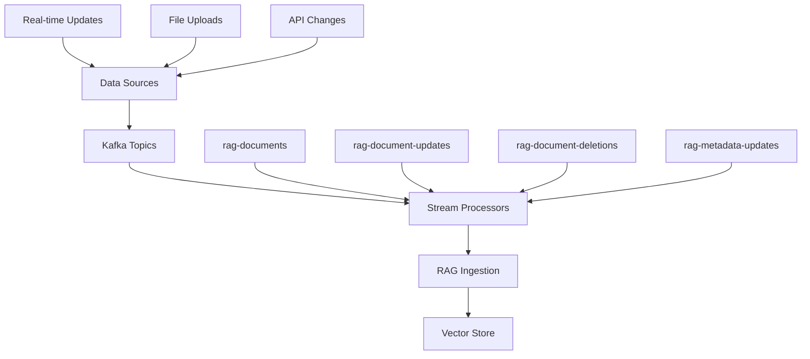

# Real-time Streaming Setup with Kafka

*Setting up real-time document ingestion and processing*

## Overview

This guide shows you how to set up real-time streaming data ingestion using Apache Kafka, enabling your RAG system to process documents and updates as they arrive, rather than in batch mode.

## 🔄 Streaming Architecture



## 🚀 Setup Instructions

### 1. Start Kafka Infrastructure

```bash
# Start Kafka and related services
docker-compose -f docker-compose.datalake.yml up -d zookeeper kafka schema-registry kafka-connect

# Wait for services to be ready (about 2 minutes)
sleep 120

# Verify Kafka is running
docker exec -it $(docker ps -q -f name=kafka) kafka-topics --bootstrap-server localhost:9092 --list
```

### 2. Create Kafka Topics

```bash
# Create topics for RAG streaming
docker exec -it $(docker ps -q -f name=kafka) kafka-topics \
  --create --bootstrap-server localhost:9092 \
  --topic rag-documents --partitions 3 --replication-factor 1

docker exec -it $(docker ps -q -f name=kafka) kafka-topics \
  --create --bootstrap-server localhost:9092 \
  --topic rag-document-updates --partitions 3 --replication-factor 1

docker exec -it $(docker ps -q -f name=kafka) kafka-topics \
  --create --bootstrap-server localhost:9092 \
  --topic rag-document-deletions --partitions 1 --replication-factor 1

docker exec -it $(docker ps -q -f name=kafka) kafka-topics \
  --create --bootstrap-server localhost:9092 \
  --topic rag-metadata-updates --partitions 1 --replication-factor 1

# Verify topics were created
docker exec -it $(docker ps -q -f name=kafka) kafka-topics \
  --bootstrap-server localhost:9092 --list
```

### 3. Configure Schema Registry

```bash
# Register document schema
curl -X POST http://localhost:8081/subjects/rag-documents-value/versions \
  -H "Content-Type: application/vnd.schemaregistry.v1+json" \
  -d '{
    "schema": "{\"type\":\"record\",\"name\":\"Document\",\"fields\":[{\"name\":\"event_type\",\"type\":\"string\"},{\"name\":\"timestamp\",\"type\":\"string\"},{\"name\":\"document_id\",\"type\":\"string\"},{\"name\":\"data\",\"type\":{\"type\":\"record\",\"name\":\"DocumentData\",\"fields\":[{\"name\":\"content\",\"type\":\"string\"},{\"name\":\"metadata\",\"type\":{\"type\":\"map\",\"values\":\"string\"}}]}}]}"
  }'
```

## 📨 Producer Setup

### Python Producer Example

```python
# streaming_producer.py
import json
import asyncio
from datetime import datetime
from src.prod_rag.streaming.kafka_producer import get_kafka_producer

async def send_document_example():
    """Send a document via Kafka streaming."""
    producer = get_kafka_producer()
    
    # Create sample document
    document_data = {
        'content': '''
        Breaking News: Revolutionary AI Chip Announced
        
        TechCorp unveiled their new AI acceleration chip, the NeuroMax 5000, 
        which promises 10x faster machine learning inference compared to 
        current generation chips.
        
        Key Features:
        - 10x performance improvement
        - 50% power reduction
        - Built-in security features
        - Support for all major ML frameworks
        
        The chip will be available to manufacturers starting Q3 2024.
        ''',
        'metadata': {
            'filename': 'ai-chip-announcement.txt',
            'title': 'Revolutionary AI Chip Announced',
            'author': 'Tech News Team',
            'source': 'tech-news-api',
            'category': 'technology',
            'tags': ['AI', 'chips', 'hardware', 'performance'],
            'file_type': 'txt'
        }
    }
    
    # Send to Kafka
    success = await producer.send_document(
        document_data=document_data,
        document_id='tech_news_001',
        partition_key='technology'
    )
    
    if success:
        print("✅ Document sent successfully!")
    else:
        print("❌ Failed to send document")

# Run the example
if __name__ == "__main__":
    asyncio.run(send_document_example())
```

### Batch Document Producer

```python
# batch_streaming_producer.py
import asyncio
import json
from src.prod_rag.streaming.kafka_producer import get_kafka_producer

async def send_batch_documents():
    """Send multiple documents in batch."""
    producer = get_kafka_producer()
    
    # Sample batch of documents
    documents = [
        {
            'document_id': 'batch_doc_001',
            'content': 'First document content...',
            'metadata': {
                'title': 'Document 1',
                'category': 'research',
                'file_type': 'txt'
            }
        },
        {
            'document_id': 'batch_doc_002', 
            'content': 'Second document content...',
            'metadata': {
                'title': 'Document 2',
                'category': 'news',
                'file_type': 'txt'
            }
        },
        {
            'document_id': 'batch_doc_003',
            'content': 'Third document content...',
            'metadata': {
                'title': 'Document 3',
                'category': 'tutorial',
                'file_type': 'txt'
            }
        }
    ]
    
    # Send batch
    result = await producer.send_batch_documents(
        documents=documents,
        batch_id='demo_batch_001'
    )
    
    print(f"Batch result: {result}")

if __name__ == "__main__":
    asyncio.run(send_batch_documents())
```

## 📥 Consumer Setup

### Start the Streaming Consumer

```python
# streaming_consumer.py
import asyncio
from src.prod_rag.streaming.kafka_consumer import start_streaming_consumer

async def main():
    """Start the RAG streaming consumer."""
    print("🚀 Starting RAG streaming consumer...")
    print("The consumer will process documents from Kafka topics in real-time.")
    print("Press Ctrl+C to stop.")
    
    try:
        await start_streaming_consumer()
    except KeyboardInterrupt:
        print("\n⏹️ Stopping consumer...")
    except Exception as e:
        print(f"❌ Consumer error: {e}")

if __name__ == "__main__":
    asyncio.run(main())
```

### Run the Consumer as Background Service

```bash
# Method 1: Direct Python execution
python streaming_consumer.py &

# Method 2: Using nohup for persistent background execution
nohup python streaming_consumer.py > consumer.log 2>&1 &

# Method 3: Using screen for manageable background execution
screen -dmS rag-consumer python streaming_consumer.py

# Check if consumer is running
ps aux | grep streaming_consumer
```

## 🔄 Testing Real-time Streaming

### Test 1: Send Single Document

```python
# test_single_document.py
import asyncio
from datetime import datetime

async def test_single_document():
    from src.prod_rag.streaming.kafka_producer import get_kafka_producer
    
    producer = get_kafka_producer()
    
    document = {
        'content': f'''
        Test Document Created at {datetime.now()}
        
        This is a test document sent via Kafka streaming to verify 
        the real-time ingestion pipeline is working correctly.
        
        Features being tested:
        - Kafka message production
        - Real-time consumption
        - Document processing
        - Vector store insertion
        - Search availability
        
        If you can query for this document immediately after sending,
        the streaming pipeline is working correctly!
        ''',
        'metadata': {
            'filename': f'test_doc_{datetime.now().strftime("%Y%m%d_%H%M%S")}.txt',
            'title': 'Streaming Test Document',
            'author': 'Test System',
            'source': 'streaming_test',
            'file_type': 'txt',
            'tags': ['test', 'streaming', 'real-time']
        }
    }
    
    success = await producer.send_document(
        document_data=document,
        document_id=f'streaming_test_{int(datetime.now().timestamp())}',
        partition_key='test'
    )
    
    return success

if __name__ == "__main__":
    result = asyncio.run(test_single_document())
    print(f"Document sent: {result}")
```

### Test 2: Verify Real-time Processing

```bash
# Wait a few seconds after sending, then query
sleep 5

# Query for the test document
curl -X POST "http://localhost:8000/api/v1/query" \
  -H "Content-Type: application/json" \
  -d '{
    "query": "streaming test document kafka real-time",
    "max_results": 3
  }'
```

If you see your test document in the results, streaming is working! 🎉

### Test 3: Document Updates

```python
# test_document_update.py
import asyncio
from datetime import datetime

async def test_document_update():
    from src.prod_rag.streaming.kafka_producer import get_kafka_producer
    
    producer = get_kafka_producer()
    
    # Send update for existing document
    updates = {
        'content': f'''
        UPDATED: Test Document - Updated at {datetime.now()}
        
        This document has been updated via Kafka streaming to test
        the real-time update functionality.
        
        Update features tested:
        - Document content modification
        - Metadata updates
        - Re-indexing in vector store
        - Search result updates
        
        This updated content should replace the previous version.
        ''',
        'metadata': {
            'title': 'UPDATED: Streaming Test Document',
            'last_updated': datetime.now().isoformat(),
            'version': '2.0',
            'file_type': 'txt'
        }
    }
    
    success = await producer.send_document_update(
        document_id='streaming_test_001',  # Use existing document ID
        updates=updates,
        update_type='content'
    )
    
    return success

if __name__ == "__main__":
    result = asyncio.run(test_document_update())
    print(f"Update sent: {result}")
```

### Test 4: Document Deletion

```python
# test_document_deletion.py
import asyncio

async def test_document_deletion():
    from src.prod_rag.streaming.kafka_producer import get_kafka_producer
    
    producer = get_kafka_producer()
    
    # Delete a document
    success = await producer.send_document_deletion('streaming_test_001')
    
    return success

if __name__ == "__main__":
    result = asyncio.run(test_document_deletion())
    print(f"Deletion sent: {result}")
```

## 🔍 Monitoring Streaming Pipeline

### Kafka Monitoring

```bash
# Check topic details
docker exec -it $(docker ps -q -f name=kafka) kafka-topics \
  --bootstrap-server localhost:9092 \
  --describe --topic rag-documents

# Monitor consumer lag
docker exec -it $(docker ps -q -f name=kafka) kafka-consumer-groups \
  --bootstrap-server localhost:9092 \
  --describe --group rag-document-processor

# View recent messages
docker exec -it $(docker ps -q -f name=kafka) kafka-console-consumer \
  --bootstrap-server localhost:9092 \
  --topic rag-documents \
  --from-beginning --max-messages 5
```

### Consumer Health Check

```python
# check_consumer_health.py
import asyncio
import json

async def check_consumer_health():
    from src.prod_rag.streaming.kafka_consumer import get_kafka_consumer
    
    consumer = await get_kafka_consumer()
    health = await consumer.health_check()
    
    print("Consumer Health:")
    print(json.dumps(health, indent=2))
    
    stats = await consumer.get_consumer_stats()
    print("\nConsumer Statistics:")
    print(json.dumps(stats, indent=2))

if __name__ == "__main__":
    asyncio.run(check_consumer_health())
```

### Grafana Streaming Metrics

Add these panels to your Grafana dashboard:

1. **Messages per Second**: `rate(kafka_consumer_records_consumed_total[1m])`
2. **Consumer Lag**: `kafka_consumer_lag_sum`
3. **Processing Time**: `histogram_quantile(0.95, rate(rag_streaming_processing_duration_seconds_bucket[5m]))`
4. **Error Rate**: `rate(rag_streaming_errors_total[5m])`

## 🔧 Advanced Streaming Patterns

### Dead Letter Queue (DLQ)

Handle failed message processing:

```python
# Configure DLQ in consumer
DLQ_CONFIG = {
    "max_retries": 3,
    "retry_delay_seconds": 5,
    "dlq_topic": "rag-documents-dlq",
    "error_handler": "log_and_continue"
}
```

### Message Filtering

Process only specific document types:

```python
# In consumer configuration
MESSAGE_FILTERS = {
    "content_types": ["text/plain", "application/pdf"],
    "max_size_bytes": 10 * 1024 * 1024,  # 10MB
    "required_fields": ["content", "metadata.title"],
    "exclude_patterns": ["test_*", "temp_*"]
}
```

### Batch Processing

Process multiple messages together:

```python
BATCH_CONFIG = {
    "batch_size": 100,
    "batch_timeout_seconds": 30,
    "parallel_processing": True,
    "max_concurrent_batches": 5
}
```

## 🚨 Troubleshooting

### Common Issues

**Consumer not receiving messages:**
```bash
# Check if consumer group is active
docker exec -it $(docker ps -q -f name=kafka) kafka-consumer-groups \
  --bootstrap-server localhost:9092 --list

# Reset consumer group if needed
docker exec -it $(docker ps -q -f name=kafka) kafka-consumer-groups \
  --bootstrap-server localhost:9092 \
  --group rag-document-processor --reset-offsets --to-earliest --all-topics --execute
```

**Messages not being processed:**
```bash
# Check consumer logs
docker logs $(docker ps -q -f name=airflow-worker) | grep -i kafka

# Verify RAG pipeline is running
curl http://localhost:8000/api/v1/health
```

**High consumer lag:**
```bash
# Scale up consumers
docker-compose -f docker-compose.datalake.yml up -d --scale airflow-worker=3

# Or start additional consumer instances
python streaming_consumer.py &
python streaming_consumer.py &
```

## 📈 Performance Optimization

### Producer Optimization

```python
PRODUCER_CONFIG = {
    "batch_size": 16384,
    "linger_ms": 10,
    "compression_type": "gzip",
    "acks": "all",
    "retries": 3,
    "max_request_size": 1048576  # 1MB
}
```

### Consumer Optimization

```python
CONSUMER_CONFIG = {
    "fetch_min_bytes": 1024,
    "fetch_max_wait_ms": 500,
    "max_poll_records": 500,
    "session_timeout_ms": 30000,
    "heartbeat_interval_ms": 10000
}
```

## 🔗 Integration Examples

### Web Application Integration

```javascript
// Real-time document upload with streaming
async function uploadDocumentStream(file, metadata) {
    const formData = new FormData();
    formData.append('file', file);
    formData.append('metadata', JSON.stringify(metadata));
    formData.append('streaming', 'true');
    
    const response = await fetch('/api/v1/documents/upload', {
        method: 'POST',
        body: formData
    });
    
    const result = await response.json();
    
    if (result.streaming_enabled) {
        // Document will be processed in real-time
        console.log('Document queued for streaming processing');
        
        // Poll for completion
        pollProcessingStatus(result.document_id);
    }
}

function pollProcessingStatus(documentId) {
    const interval = setInterval(async () => {
        const response = await fetch(`/api/v1/documents/${documentId}/status`);
        const status = await response.json();
        
        if (status.processed) {
            clearInterval(interval);
            console.log('Document processed and available for search!');
        }
    }, 1000);
}
```

### API Integration

```python
# API endpoint that triggers streaming
from fastapi import APIRouter, File, UploadFile
from src.prod_rag.streaming.kafka_producer import get_kafka_producer

router = APIRouter()

@router.post("/documents/stream")
async def stream_document(file: UploadFile = File(...)):
    """Stream upload document for real-time processing."""
    
    content = await file.read()
    
    producer = get_kafka_producer()
    success = await producer.send_document(
        document_data={
            'content': content.decode('utf-8'),
            'metadata': {
                'filename': file.filename,
                'content_type': file.content_type,
                'upload_timestamp': datetime.utcnow().isoformat()
            }
        },
        document_id=f"upload_{uuid.uuid4()}",
        partition_key=file.content_type
    )
    
    return {
        "status": "queued" if success else "failed",
        "message": "Document queued for real-time processing"
    }
```

## 📚 Next Steps

- [Complete Data-to-Chat Tutorial](data-to-chat-complete-guide.md)
- [Data Lake Setup Guide](data-lake-setup.md) 
- [Custom Connectors Guide](../advanced/custom-connectors.md)
- [Scaling and Performance](../advanced/scaling-guide.md)

## 🔗 Useful Commands

```bash
# Start streaming consumer
python -c "import asyncio; from src.prod_rag.streaming.kafka_consumer import start_streaming_consumer; asyncio.run(start_streaming_consumer())"

# Send test document
python tutorials/demo-data/test_streaming.py

# Monitor Kafka topics
docker exec -it $(docker ps -q -f name=kafka) kafka-console-consumer --bootstrap-server localhost:9092 --topic rag-documents

# Check consumer health
curl http://localhost:8000/api/v1/streaming/health
```
